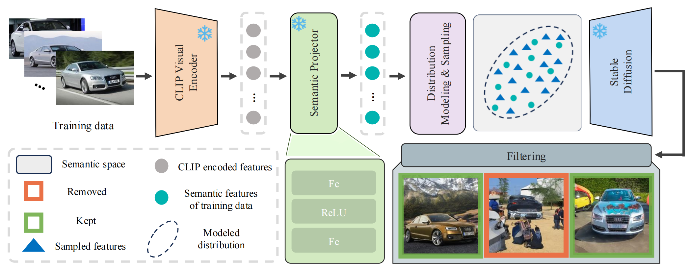
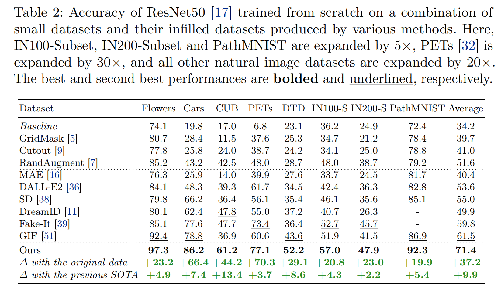

# Visual Dataset Augmentation via Accurate Semantic Distribution Infilling

This repository is the official PyTorch implementation of **"Visual Dataset Augmentation via Accurate Semantic Distribution Infilling"**.

## 📖 Introduction

This project provides a framework for augmenting visual datasets by accurately infilling the semantic distribution. The pipeline involves training a semantic projector to map CLIP image features into the semantic space of Stable Diffusion (SD), extracting original semantic features, sampling new features from the distribution, and generating synthetic images to enrich the dataset.

## 🏗 Network Architecture


## 🚀 Usage

To use this codebase, the general workflow is as follows:
1.  **Train a Semantic Projector**: Map image features from CLIP into the semantic space of Stable Diffusion.
2.  **Extract Features**: Extract semantic features from the original dataset.
3.  **Sample & Generate**: Sample new image features based on the learned distribution and generate images using the sampled features.

The following examples use the **CUB dataset** to demonstrate the workflow. You can find commands of other datasets in `train`, `getEmbedding`, `generate`, and `main` files.

### 1. Prepare Dataset
Please refer to the following guide to obtain the specific train/test splits for the dataset:
[CUB Dataset Split Guide](https://blog.csdn.net/wangpy12321/article/details/142533980)

### 2. Aligning Image Features with Semantic Space
Run the following command to train the `semantic projector`.
**Note:** You must modify `pretrained_model_name_or_path`, `data_path`, `clip_path`, and `output_dir` in the script to match your local environment configuration.

```shell 
sbatch train_CUB.sh
```

### 3. New Semantic Features Sampling and Image Generation

**Step A: Extract Embeddings**
Run the following command using the checkpoint trained in the previous step to calculate feature embeddings for the original dataset.
**Note:** Update `projector_ckpt`, `data_root`, and `save_root` in the script.

```shell 
sbatch getEmbedding_CUB.sh
```

**Step B: Semantic Distribution Infilling (SEI)**
Run the following command to sample new semantic feature embeddings from the distribution constructed from the original embeddings. These sampled features are then used to generate new images, effectively infilling the semantic distribution of the original dataset.
**Note:** Update `pt_root` (path to embeddings from Step A), `save_root`, and `data_root` in the script.

```shell 
sbatch SEI_CUB.sh
```

### 4. Filtering Deficient Samples
Select the appropriate code block within `filter.sh` to filter the generated images.
**Note:** Before running, please modify the path configurations in the `config` file.

```shell 
sbatch filter.sh
```

### 5. Train and Test (Downstream Task)
We train a ResNet50 from scratch using the augmented dataset to evaluate performance.
**Note:** Before running, please modify the path configurations in the `config` file.

```shell 
sbatch main_CUB.sh
```

## 📊 Performance


## 📝 TODO 
- [ ] Release the checkpoints
- [ ] Simplify codes for user-friendly usage

## 🙌 Acknowledgement
Part of our codes are based on [ALIA](https://github.com/lisadunlap/ALIA) and [IP-Adapter](https://github.com/tencent-ailab/IP-Adapter). Thanks for their awesome work!